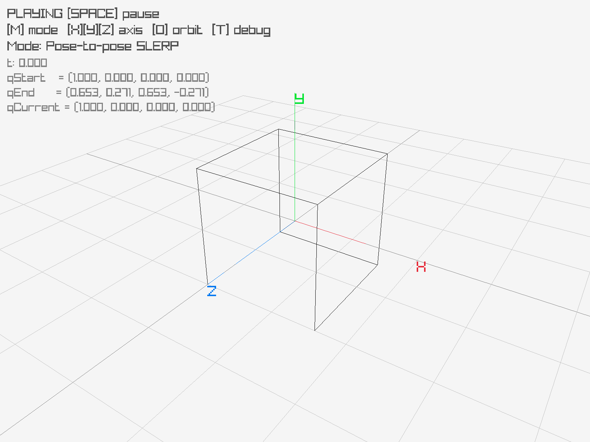
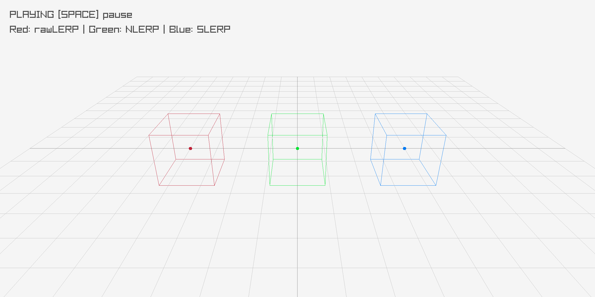

# Quaternion Cube SLERP Visualization

This project demonstrates quaternion-based 3D rotations and smooth interpolation (SLERP) using a rotating cube in **C++** with [raylib](https://www.raylib.com/) for rendering.

You can rotate the cube around an axis, interpolate between poses, and visualize vertex trails to see the path of the rotation in 3D space.

---

## Features

- 3D cube with smooth quaternion rotations
- Interactive Axis-360 and Pose-to-Pose SLERP demos
- Vertex trails to visualize rotation paths
- Camera orbit and simple controls
- Optional quaternion debug info

---

## Controls

| Key        | Action                                        |
|------------|-----------------------------------------------|
| `X`, `Y`, `Z` | Set rotation axis for Axis-360 mode       |
| `SPACE`    | Play/pause animation                          |
| `LEFT` / `RIGHT` | Scrub backward/forward in time          |
| `O`        | Toggle camera orbit                           |
| `T`        | Toggle quaternion debug info                  |
| `M`        | Switch between Axis-360 and Pose-to-Pose mode |

---

## Theory

### Quaternions

A quaternion is a four-dimensional number used to represent 3D rotations. In this project, we use **unit quaternions**, which are constrained to unit length ($\|q\| = 1$) and lie on the 4D unit sphere (often denoted $S^3$). This makes them well-suited for stable and smooth rotation interpolation.

We construct quaternions from an **axis-angle representation**, which is intuitive for 3D rotations:

$$
q = \left(\cos(\theta/2), \; \sin(\theta/2)\ \mathbf{u}\right)
$$

Where:

- $w = \cos(\theta/2)$ → scalar part  
- $\mathbf{v} = \sin(\theta/2) \cdot \mathbf{u}$ → vector part  
- $\mathbf{u}$ is the normalized rotation axis  
- $\theta$ is the rotation angle in radians  

This representation avoids **gimbal lock** and provides a compact way to encode rotations.

---

### Key Operations

1. **Normalization**  
Ensures the quaternion represents a valid rotation:
$q_{\text{normalized}} = \frac{q}{\|q\|}$

2. **Multiplication**  
Combines rotations:
$q_{\text{result}} = q_1 \cdot q_2$

3. **Inverse**  
Represents the opposite rotation:
$q^{-1} = \frac{(w, -x, -y, -z)}{w^2 + x^2 + y^2 + z^2}$

4. **Rotate a vector**  
A vector $\mathbf{v}$ is embedded as a pure quaternion $(0, \mathbf{v})$:
$\mathbf{v}_{\text{rotated}} = q \cdot (0, \mathbf{v}) \cdot q^{-1}$

---

### SLERP (Spherical Linear Interpolation)

SLERP provides smooth interpolation between two unit quaternions $q_0$ and $q_1$ over a parameter $t \in [0,1]$:

$$
\text{SLERP}(q_0, q_1, t) = \frac{\sin((1-t)\theta)}{\sin(\theta)} q_0 + \frac{\sin(t\theta)}{\sin(\theta)} q_1
$$

Where:
- $\theta = \arccos(q_0 \cdot q_1)$ is the angle between quaternions  

SLERP ensures **constant angular velocity** along the interpolation path.

In practice, if $q_0 \cdot q_1 < 0$, one quaternion is negated to ensure interpolation follows the **shortest path** on the unit sphere.

If the quaternions are very close, SLERP is often approximated using normalized linear interpolation (NLERP) to avoid numerical instability.

---

### Demonstration: Pose-to-Pose SLERP

Start and end orientations:

- **qStart**: Identity orientation (no rotation)  
- **qEnd**: 45° rotation around the X-axis, followed by 90° rotation around the Y-axis  


This animation is generated using the interactive demo (`main.cpp`):




---

## Comparison: LERP vs NLERP vs SLERP

This demo rotates three cubes side-by-side using different interpolation methods:

- **LERP**: Does not preserve unit length, leading to invalid rotations unless normalized  
- **NLERP**: Maintains unit length (after normalization) but does not preserve constant angular velocity  
- **SLERP**: Preserves unit length and provides constant angular velocity along the shortest path  


This animation is generated using the interactive demo (`demo_interpolation.cpp`):





### Summary Table

| Method   | Angular Speed     | Accuracy                     |
|----------|------------------|-----------------------------|
| **LERP** | Non-uniform      | Leaves unit sphere          |
| **NLERP**| Non-uniform      | Approximate rotation        |
| **SLERP**| Uniform          | Exact shortest-path rotation|

---

## Numerical Considerations

- Quaternions are periodically **renormalized** to avoid drift due to floating-point errors  
- SLERP is approximated with NLERP when angles are very small  
- Quaternion sign ambiguity ($q$ and $-q$ represent the same rotation) is handled to ensure shortest-path interpolation  

---

## Tests and Validation

The project includes unit tests to validate the correctness of the mathematical components:

- **test_Quat.cpp**  
  Verifies quaternion operations such as normalization, multiplication, inversion, and vector rotation.

- **test_Vec3.cpp**  
  Tests fundamental vector operations used throughout the project.

These tests ensure correctness and numerical consistency of the implemented math primitives.
In addition to unit tests, visual validation is performed using interactive demos to analyze interpolation behavior.

---

## Practical Notes

In practice, different representations of rotations are used together. Quaternions are typically used for **storing and interpolating rotations**, while rotation matrices are used when **applying transformations to many vertices efficiently**.

---


## Project Structure


```
QuaternionSLERP/
├── include/
│   ├── math/
│   │   ├── quat.h         # Quaternion class and operations (w interpolations)
│   │   └── vec3.h         # 3D vector utilities
│   └── geometry/
│       └── cube.h         # Unit Cube Initialization
├── src/
│   └── main.cpp           # Main application, rendering loop, and controls
├── tests/
│   ├── test_Quat.cpp        # Unit tests for quaternion operations
│   ├── test_Vec3.cpp        # Unit tests for vector operations
├── demos/
│   └── demo_interpolation.cpp   # visual comparison of interpolation methods
└── README.md
```


## Dependencies

- C++17 compatible compiler
- [raylib](https://www.raylib.com/) for rendering

## Build & Run

```bash
git clone <https://github.com/aimenboughanmi/QuaternionSLERP>
cd QuaternionSLERP
g++ main.cpp -o cube -lraylib -lm -ldl -lpthread -lGL -lX11
./cube
```

## Demo Modes

- **Axis-360 Rotation**: Cube rotates continuously around a selected axis (X, Y, or Z).
- **Pose-to-Pose SLERP**: Smooth interpolation between two arbitrary cube orientations.
